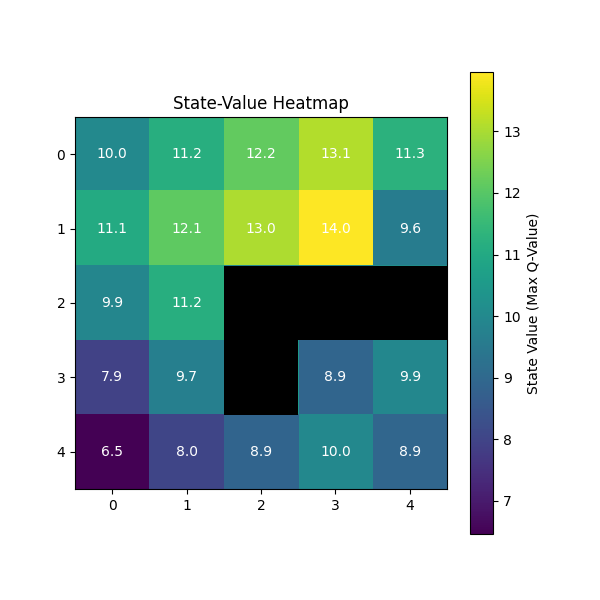

# GridWorld Deep Q-Network (DQN) Agent


## Table of Contents

- [Project Overview](#project-overview)
- [Features](#features)
- [Environment Setup](#environment-setup)
- [Folder Structure](#folder-structure)
- [Usage](#usage)
- [Configuration](#configuration)
- [Project Components](#project-components)
- [Training Details](#training-details)
- [Visualization](#visualization)
- [Results and Evaluation](#results-and-evaluation)
- [Extending the Project](#extending-the-project)
- [Advanced Features and Known Limitations](#advanced-features-and-known-limitations)
- [References](#references)
- [License](#license)

## Project Overview

This project implements a Deep Q-Network (DQN) agent to solve a custom 5x5 GridWorld reinforcement learning environment. The agent learns to navigate the grid to reach a terminal goal with reward +10, avoid obstacles, and optionally perform special “jump” moves for additional rewards (+5). The solution includes a state-of-the-art Deep Reinforcement Learning implementation written in PyTorch, modularized for clarity and extendability.

**Core objectives:**

- Implement environment dynamics reflecting obstacles, start/terminal states, rewards
- Design and train a DQN agent using experience replay and target networks
- Implement epsilon-greedy exploration/exploitation strategy
- Visualize learned state-values as heatmaps for intuitive interpretation
- Provide a reusable and scalable codebase for further RL experimentation

## Features

- Custom 5x5 GridWorld environment with obstacles and special jump states
- Deep Q-Network agent with fully connected neural networks
- Experience replay buffer for de-correlated training samples
- Target network for stabilized Q-value updates
- Configurable hyperparameters via `config.py`
- Training progress logs and early stopping criteria
- State-value heatmap visualizations for qualitative evaluation
- Modularized code structure facilitating maintainability and testing

## Environment Setup

### Prerequisites

- Python 3.9
- PyTorch
- NumPy
- Matplotlib

### Installation

```bash
# Create and activate virtual environment (optional but recommended)
python3.9 -m venv .venv
source .venv/bin/activate  # On Windows: .\venv\Scripts\activate

# Install dependencies
pip install -r requirements.txt
```

`requirements.txt` includes:

```
torch
torchvision
numpy
matplotlib
```

## Folder Structure

```
gridworld_rl/
├── README.md               # This file
├── requirements.txt        # Python dependencies
├── config.py               # All hyperparameters and env config
├── run_training.py         # Main script to train and visualize
├── make_env.py             # Helper for environment instantiation
├── src/
│   ├── __init__.py
│   ├── env.py              # GridWorld environment class
│   ├── agent.py            # DQN model and training logic
│   ├── replay_buffer.py    # Experience replay buffer class
│   ├── generate_visuals.py # Plotting functions
│   └── utils.py            # helper functions
├── results/
│   ├── trained_dqn.pt      # Saved model checkpoint (after training)
│   ├── game-grid.png  # grid world structure
│   ├── heatmap.png   
│   ├── policy_map.png     
│   ├── rewards_plot.png        
│   └── learning_rate_comparison.png  
└── checkpoints/
    └── dqn_ep30.pt # checkpointing and logging during training
    .
    .
    .
    └── dqn_ep300.pt 
```

## Usage

### Train the DQN Agent

```bash
python run_training.py
```

This will:

- Train the agent for configured episodes (default 300)
- Log progress to the console
- Save the trained model checkpoint to `results/trained_dqn.pt`
- Generate and display a state-value heatmap visualization
- Save logs and figures to `results/` directory

### Configuring Training

All hyperparameters are configurable via `config.py`, including:

- Number of episodes
- Learning rate
- Discount factor (gamma)
- Epsilon-greedy parameters
- Batch size and replay buffer size
- Environment layout (obstacles, jump states, start/goal positions)

## Configuration

Edit `config.py` to tune training and environment parameters. For example:

```python
EPISODES = 200
LEARNING_RATE = 1e-3
GAMMA = 0.99
EPSILON_START = 1.0
EPSILON_END = 0.05
EPSILON_DECAY = 0.995
BATCH_SIZE = 64
BUFFER_SIZE = 10000
TARGET_UPDATE = 10

# Environment grid setup
N_ROWS = 5
N_COLS = 5
START_POS = (1, 0)
TERMINAL_POS = (4, 4)
JUMP_FROM = (1, 3)
JUMP_TO = (3, 3)
OBSTACLES = [(2, 2), (2, 3), (2, 4), (3, 2)]  # Customize as needed
```

## Project Components

### 1. `src/env.py`

- Implements the GridWorld environment with obstacles, special jump cells, start and goal.
- Encodes the agent’s position as a one-hot vector for input to DQN.

### 2. `src/agent.py`

- Defines the neural network architecture for the DQN.
- Contains the main training loop implementing experience replay and target networks.
- Implements the epsilon-greedy strategy for balancing exploration and exploitation.

### 3. `src/replay_buffer.py`

- Implements a replay buffer that stores past transitions.
- Provides randomized batch sampling for training stability.

### 4. `src/utils.py`

- Contains helper functions such as epsilon scheduling or CSV logging.

### 5. `src/generate_visuals.py`

- Provides visualization tools (heatmaps of state-values, learning rate plots etc).

### 6. `make_env.py`

- A factory module to instantiate the grid environment with customizable parameters for experiments or testing.

## Training Details

- **Episodes:** Default 100 (recommend increasing up to 1000 for improved learning)
- **Exploration:** Starts with ε=1.0 and decays gradually (ε=0.05 min)
- **Learning rate:** 0.001 (Adam optimizer)
- **Discount factor:** 0.99 (future reward discounting)
- **Batch size:** 64 samples per training step
- **Replay buffer size:** 10,000 transitions
- **Target network update frequency:** Every 10 episodes

Training uses the Q-learning update rule with neural network function approx.:

$$
Q(s,a) \leftarrow Q(s,a) + \alpha \left[ r + \gamma \max_{a'} Q_{\text{target}}(s',a') - Q(s,a) \right]
$$

# Visualization
The project generates a state-value heatmap, learning rates comparison, policy-map and reward maps. This visualization helps verify that the agent understands where high-value states (like the terminal goal and jump states) are, and whether it successfully avoids obstacles.

## Demo Images
Here are example results from training your Deep Q-Network agent:

### Training Reward Log Snapshot:


This image shows episode-wise rewards and mean rewards improving over training. Early episodes have negative rewards as the agent explores, but performance improves steadily.

### State-Value Heatmap:

#### Important Note about the Terminal State Cell (4,4):
You might expect the bottom-right cell (4,4) — the terminal state with the +10 reward — to have the brightest color indicating the highest value. However, sometimes it does not appear as the brightest in the heatmap. Here's why:

- Terminal state value equals immediate reward only:
Since the terminal state ends the episode, its value reflects the immediate reward (+10) with no future rewards beyond it.

- Neighboring states may have higher expected rewards:
Cells adjacent to the goal incorporate the terminal reward plus discounted future rewards (depending on the discount factor). This can numerically result in Q-values that appear even higher than the terminal state's immediate reward, causing those neighbor states to appear visually brighter.

- Color scaling in visualization:
The heatmap uses a color scale mapped to the entire range of state values. If other states have values close to or above 10 due to special jumps or accumulated discounted rewards, these can overshadow the terminal state’s raw reward in the color mapping.

- Training convergence status:
If training isn't fully converged yet, the terminal state's Q-value might not be the absolute highest due to ongoing updates and exploration.

### How to Verify:
You can print the exact learned Q-values for the terminal state and surrounding states after training, for example:

```python
pos = (4, 4)
state_vec = env.encode(pos)
with torch.no_grad():
    q_values = dqn(torch.tensor(state_vec).unsqueeze(0))
    max_q = q_values.max().item()
    print(f"Max Q-value at terminal state (4,4): {max_q}")

# Check neighboring states similarly
```
This will give you the precise values behind the heatmap colors.
## Results and Evaluation

Typical training output logs will show episode-wise rewards, exploration rates, and rolling mean rewards. Improvement indicates successful learning.

Example:

```
Ep 10 | Reward: -103 | Mean(last30): -17.30 | Epsilon: 0.86
...
Ep 100 | Reward: 11 | Mean(last30): 6.57 | Epsilon: 0.22
```

## Extending the Project

- Increase grid size or complexity
- Add stochastic transitions/noise
- Implement Double DQN or Dueling DQN architectures
- Add multiple agents or adversarial elements
- Incorporate visualization of policies and trajectories

## Advanced Features and Known Limitations

- **Simple network architecture:** The current DQN uses fully connected layers without convolutional or advanced architectures such as Double or Dueling DQN, which might improve performance and stability.
- **Fixed grid size:** The environment is currently fixed to a 5x5 grid, with potential for extension through code modifications.
- **Training time:** Training time increases significantly with large episode counts (e.g., 100 episodes).
- **Early stopping implemented:** The training includes an *early stopping mechanism* based on recent mean episode rewards, which helps halt training automatically once sufficient performance is achieved, saving time and resources.
- **Checkpointing implemented:** The code **periodically saves model checkpoints** during training (e.g., every 30 or 60 episodes), protecting against loss of progress from interruptions and enabling resumed training or intermediate evaluation.
- **Exploration decay fixed:** The epsilon decay strategy is currently fixed and may require tuning for more complex environments or different training durations.
- **Visualization nuances:** Heatmaps may not always visually highlight terminal states due to the nature of discounted rewards and color scaling; numerical inspection is recommended for detailed analysis.


## Checkpointing and Logging

Checkpointing frequency can be easily adjusted in the training loop. For example, to save a model every **50** episodes, use:

```python
if (episode + 1) % 30 == 0:
    checkpoint_path = os.path.join(CHECKPOINT_DIR, f"dqn_ep{episode + 1}.pt")
    torch.save(dqn.state_dict(), checkpoint_path)
    print(f"Checkpoint saved: {checkpoint_path}")
```

Or for every **100** episodes, simply replace `50` with `100` in the condition.

This mechanism complements early stopping by ensuring training progress is saved periodically.

## References

- Mnih et al., "Human-level control through deep reinforcement learning," Nature, 2015.
- OpenAI Spinning Up in Deep RL: https://spinningup.openai.com/en/latest/
- PyTorch tutorials: https://pytorch.org/tutorials/
- Assignment original specifications and lecture notes

## License

This project is provided under the MIT License. See [LICENSE](LICENSE) file for details.

# Contact

Created by Faith Olubummo for COM762 Coursework 2 Deep Learning Assignment.

Questions or feedback? Open an issue
